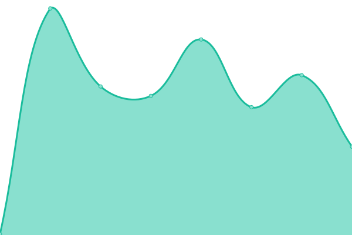

# [📈 Live Status](https://status.crz.ro): <!--live status--> **🟧 Partial outage**

This repository contains the open-source uptime monitor and status page for [Cătălin Corozanu](https://corozanu.ro), powered by [Upptime](https://github.com/upptime/upptime).

With [Upptime](https://upptime.js.org), you can get your own unlimited and free uptime monitor and status page, powered entirely by a GitHub repository. We use [Issues](https://github.com/corozanu/uptime/issues) as incident reports, [Actions](https://github.com/corozanu/uptime/actions) as uptime monitors, and [Pages](https://status.crz.ro) for the status page.

<!--start: status pages-->
<!-- This summary is generated by Upptime (https://github.com/upptime/upptime) -->
<!-- Do not edit this manually, your changes will be overwritten -->
<!-- prettier-ignore -->
| URL | Status | History | Response Time | Uptime |
| --- | ------ | ------- | ------------- | ------ |
|  [Catalin.ro](https://catalin.ro) | 🟩 Up | [catalin-ro.yml](https://github.com/corozanu/uptime.crz.ro/commits/HEAD/history/catalin-ro.yml) | 

 1280ms
     
 | 

<a href="https://uptime.crz.ro/history/catalin-ro">16.66%</a>
    

|  [Catal.in](https://catal.in) | 🟩 Up | [catal-in.yml](https://github.com/corozanu/uptime.crz.ro/commits/HEAD/history/catal-in.yml) | 

 941ms
     
 | 

<a href="https://uptime.crz.ro/history/catal-in">88.69%</a>
    

|  [FashionLady.ro](https://fashionlady.ro) | 🟥 Down | [fashion-lady-ro.yml](https://github.com/corozanu/uptime.crz.ro/commits/HEAD/history/fashion-lady-ro.yml) | 

 0ms
     
 | 

<a href="https://uptime.crz.ro/history/fashion-lady-ro">0.00%</a>
    

<!--end: status pages-->

[**Visit our status website →**](https://status.crz.ro)

## 📄 License

- Powered by: [Upptime](https://github.com/upptime/upptime)
- Code: [MIT](./LICENSE) © [Cătălin Corozanu](https://corozanu.ro)
- Data in the `./history` directory: [Open Database License](https://opendatacommons.org/licenses/odbl/1-0/)
